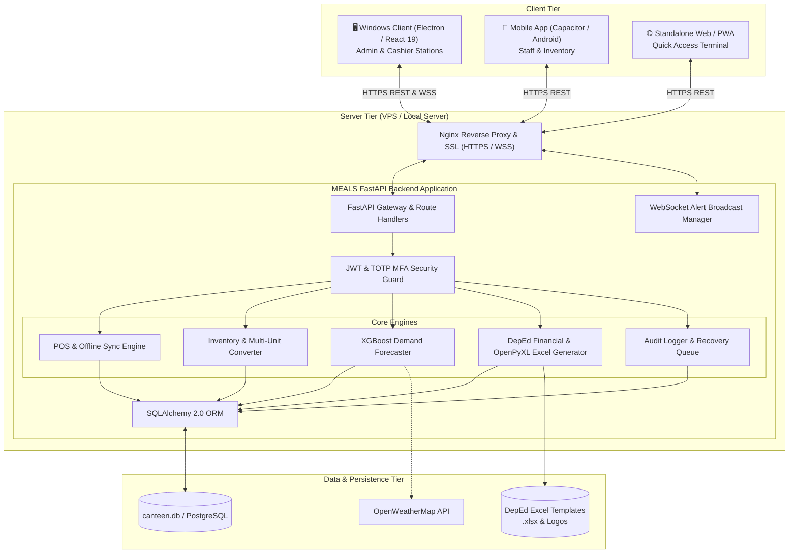

# 🍽️ SmartCanteen (MEALS) — Intelligent School Canteen Management Ecosystem

[](https://fastapi.tiangolo.com)
[](https://react.dev/)
[](https://vitejs.dev/)
[](https://www.electronjs.org/)
[](https://capacitorjs.com/)
[](https://tailwindcss.com/)
[](https://www.python.org/)
[](https://xgboost.readthedocs.io/)
[](https://opensource.org/licenses/MIT)

**SmartCanteen** (powered by the **MEALS** engine — *Management of Expenses, Assets, and Logistics System*) is a comprehensive, enterprise-grade school canteen management, Point of Sale (POS), AI demand forecasting, and statutory DepEd financial compliance platform. 

Built specifically for educational institutions, it bridges high-speed cashier operations, intelligent inventory restocking, machine-learning-driven sales prediction, multi-factor authentication (TOTP), real-time WebSocket alerts, and automated Department of Education (DepEd) official financial statement workbook generation (`.xlsx`).

---

## 📑 Table of Contents

- [Ecosystem Architecture](#-ecosystem-architecture)
- [Key Features](#-key-features)
- [Project Directory Structure](#-project-directory-structure)
- [Tech Stack Overview](#-tech-stack-overview)
- [Prerequisites](#-prerequisites)
- [Quick Start Guide](#-quick-start-guide)
  - [1. Backend Setup](#1-backend-setup)
  - [2. Desktop & Web Client Setup (`smartcanteen`)](#2-desktop--web-client-setup-smartcanteen)
  - [3. Running the Entire System](#3-running-the-entire-system)
- [Client Platforms & Distribution](#-client-platforms--distribution)
  - [Windows Desktop Client (Electron)](#windows-desktop-client-electron)
  - [Android Mobile App (Capacitor)](#android-mobile-app-capacitor)
  - [Standalone Lightweight PWA](#standalone-lightweight-pwa)
- [Role-Based Access Control (RBAC) & Credentials](#-role-based-access-control-rbac--credentials)
- [AI & Machine Learning Demand Predictor](#-ai--machine-learning-demand-predictor)
- [DepEd Financial Reporting & Excel Export](#-deped-financial-reporting--excel-export)
- [Production Deployment](#-production-deployment)
- [Subproject Documentation](#-subproject-documentation)
- [License & Maintainer](#-license--maintainer)

---

## 🏛 Ecosystem Architecture



---

## ✨ Key Features

### 🛒 1. Point of Sale (POS) & Multi-Unit Inventory
- **Rapid Cashier Interface**: Category filtering, barcode search, quick-add favorites, cash/change calculations, and discount support.
- **Piece & Bulk Measurements**: Discrete counting (`pcs`) and continuous bulk units (`kg`, `g`, `l`, `ml`) with automatic unit conversions.
- **Stock Guard & Threshold Alerts**: Real-time deductions on transaction commits with configurable `min_stock` threshold warnings.
- **Offline Resiliency**: Uninterrupted offline sales operation with automated idempotent batch sync upon network restoration.

### 🤖 2. Machine Learning Demand Forecasting
- **XGBoost Regressor Engine**: Trains on multi-year school transaction histories to predict next-day item-by-item sales volume.
- **Context-Aware Signals**: Integrates calendar day-of-week, school event schedules (regular days, half-days, exam periods, intramurals, holidays), and real-time weather forecasts (temperature, precipitation, humidity).
- **Automated Restock Warnings**: Compares predicted consumption against current stock levels to deliver actionable restock warnings.

### 📊 3. DepEd-Compliant Financial Reporting & Excel Automation
- **Statutory Compliance**: Tailored for the Department of Education (DepEd) School Canteen Operations framework.
- **Automated Fund Monitoring**: Calculates Gross Sales, Cost of Goods Sold, Operating Expenses, Net Operating Income, and bank interest.
- **Statutory Fund Allocation**: Automatically distributes net earnings across mandatory school board percentages (Supplementary Feeding 35%, Revolving/Operational Fund 25%, School Clinic 5%, Administrative Fund 5%, Faculty & Student Development 15%, etc.).
- **Live Excel Export**: Injects calculated figures into official DepEd `.xlsx` templates preserving formatting, formulas, cell styles, and logos.

### 🔐 4. Enterprise Security & TOTP Multi-Factor Authentication
- **Role-Based Access Control**: Granular permission boundaries for `admin`, `cashier`, and `staff` roles.
- **TOTP MFA**: Google Authenticator-compatible two-factor authentication with QR setup, one-time backup recovery codes, and 30-day trusted device memory.
- **Admin Recovery Queue**: Formal workflow for review and approval of lost-device MFA resets and password recovery requests.
- **Audit Logs**: Traceable logs recording IP addresses, user operations, stock edits, and configuration toggles.

### ⚡ 5. Real-Time WebSockets & Modular Architecture
- **Instant Alerts Hub**: Real-time WebSocket channel (`/api/realtime/alerts`) broadcasting low-stock notices, cashier events, and system updates.
- **Dynamic Module Management**: Toggle system modules on/off dynamically from the Admin Settings dashboard.

---

## 📂 Project Directory Structure

```text
SmartCanteen/
├── backend/                       # FastAPI Backend Application
│   ├── auth.py                    # JWT authentication & TOTP MFA logic
│   ├── analytics_helpers.py       # Sales summaries & traffic aggregations
│   ├── database.py                # Database connection & SQLAlchemy session factory
│   ├── demo_data.py               # Demo datasets & database seeder
│   ├── financial_reports.py       # DepEd financial calculations & Excel generator
│   ├── main.py                    # Main FastAPI server, routes & WebSockets
│   ├── ml_predictor.py            # XGBoost model training & weather pipeline
│   ├── ml_predictor_result.py     # Prediction data models
│   ├── models.py                  # Declarative SQLAlchemy models
│   ├── report_templates/          # Official DepEd Excel workbook templates & logos
│   │   ├── CANTEEN-REPORT-2025-2026-2 (1).xlsx
│   │   └── deped_logo.jpg
│   ├── requirements.txt           # Python dependencies
│   ├── schemas.py                 # Pydantic validation schemas
│   ├── seed_historical_canteen_data.py # 3-year historical simulation data generator
│   └── time_utils.py              # Philippine Timezone (Asia/Manila) utilities
│
├── smartcanteen/                  # Primary Frontend Client (React 19 + Electron + Capacitor)
│   ├── android/                   # Capacitor Android mobile project
│   ├── electron/                  # Electron main process & desktop configuration
│   │   ├── config.json            # Desktop API connection settings
│   │   ├── main.cjs               # Electron main entry point
│   │   └── preload.cjs            # Electron secure context bridge
│   ├── src/                       # React 19 Application Source Code
│   │   ├── assets/                # Images, icons, and illustrations
│   │   ├── components/            # Reusable UI components & modals
│   │   ├── contexts/              # Auth, Theme, Alert & Offline Contexts
│   │   ├── services/              # API clients & sync services
│   │   ├── views/                 # View pages (POS, Inventory, Financials, Predictions, etc.)
│   │   ├── App.jsx                # Application routing & layout frame
│   │   ├── index.css              # Global styles & TailwindCSS imports
│   │   └── main.jsx               # React DOM entry point
│   ├── capacitor.config.json      # Capacitor mobile app configuration
│   ├── package.json               # Node.js dependencies & build scripts
│   ├── tailwind.config.js         # TailwindCSS styling configuration
│   └── vite.config.js             # Vite bundler configuration
│
├── frontend/                      # Standalone Lightweight PWA (Vanilla JS/HTML5)
│   ├── index.html                 # Single-page PWA application
│   ├── js/                        # Pure JavaScript client modules
│   ├── manifest.json              # Web App Manifest
│   └── sw.js                      # Service Worker for offline caching
│
├── MEALS/                         # Production Release & Deployment Artifacts
│   ├── Client/                    # Compiled Windows Executable & Installer
│   │   ├── MEALS Setup.exe        # 1-Click / Custom NSIS Installer
│   │   ├── MEALS.exe              # Standalone Portable Executable
│   │   └── README.txt             # Client setup instructions
│   └── Server/                    # Virtual Server (VPS) Deployment Configuration
│       ├── DEPLOYMENT_GUIDE.md    # Step-by-step VPS server deployment guide
│       ├── init_db.py             # Server database initialization script
│       ├── meals-backend.service  # Systemd background service definition
│       ├── nginx.conf             # Nginx reverse proxy configuration
│       └── start_server.sh        # Server launch script
│
├── deploy/                        # Nginx server configurations
│   └── nginx-smartcanteen.conf    # Production Nginx reverse proxy profile
│
├── scripts/                       # Deployment and automation scripts
│   └── deploy.sh                  # One-line server build & deploy script
│
├── app.py                         # Root entry point to launch FastAPI backend
├── canteen.db                     # SQLite database file (auto-generated)
├── inspect_db.py                  # Database diagnostics and table inspector
├── pyrightconfig.json             # Python type-checking configuration
└── README.md                      # Master Repository Documentation (this file)
```

---

## 🛠 Tech Stack Overview

| Layer | Technologies |
| :--- | :--- |
| **Backend Framework** | [FastAPI](https://fastapi.tiangolo.com/) `0.115.12`, [Uvicorn](https://www.uvicorn.org/) `0.29.0`, [Pydantic](https://docs.pydantic.dev/) `2.10.6` |
| **Database & ORM** | [SQLAlchemy](https://www.sqlalchemy.org/) `2.0.49`, SQLite, [psycopg](https://www.psycopg.org/) `3.2.6` (PostgreSQL) |
| **Machine Learning** | [XGBoost](https://xgboost.readthedocs.io/) `1.7.6`, [scikit-learn](https://scikit-learn.org/) `1.5.2`, [Pandas](https://pandas.pydata.org/) `2.2.2`, [NumPy](https://numpy.org/) `1.26.4` |
| **Spreadsheet Automation** | [OpenPyXL](https://openpyxl.readthedocs.io/) `3.1.5`, [Pillow](https://python-pillow.org/) `>=10.0.0` |
| **Security & Auth** | [python-jose](https://github.com/mpdavis/python-jose) `3.3.0` (JWT), [bcrypt](https://github.com/pyca/bcrypt) `4.1.3`, TOTP MFA |
| **Frontend Framework** | [React](https://react.dev/) `19.2.4`, [Vite](https://vitejs.dev/) `8.0.4`, [React Router](https://reactrouter.com/) `7.14.1` |
| **Styling & UI** | [TailwindCSS](https://tailwindcss.com/) `4.2.2`, [Heroicons](https://heroicons.com/) `2.2.0`, [Chart.js](https://www.chartjs.org/) `4.5.1` |
| **Desktop Runtime** | [Electron](https://www.electronjs.org/) `33.2.1`, [electron-builder](https://www.electron.build/) `25.1.8` |
| **Mobile Runtime** | [Capacitor](https://capacitorjs.com/) `8.3.0` (Android) |

---

## 📦 Prerequisites

Before getting started, make sure you have the following installed on your workstation:
- **Python**: `3.10`, `3.11`, or `3.12`
- **Node.js**: `18.x`, `20.x`, or `22.x` (with `npm`)
- **Git**: Latest version
- *(Optional for Desktop packaging)*: Windows OS for NSIS/portable `.exe` builds
- *(Optional for Mobile packaging)*: Android Studio & JDK 17+

---

## 🚀 Quick Start Guide

### 1. Backend Setup

1. **Navigate to backend and create a Python virtual environment**:
   ```bash
   # Windows (PowerShell)
   python -m venv venv
   .\venv\Scripts\Activate.ps1

   # Linux / macOS
   python3 -m venv venv
   source venv/bin/activate
   ```

2. **Install Python dependencies**:
   ```bash
   pip install --upgrade pip
   pip install -r backend/requirements.txt
   ```

3. **(Optional) Seed baseline demo data or full historical simulation**:
   ```bash
   # Seed 3 years of realistic canteen transactions and weather
   python backend/seed_historical_canteen_data.py --database canteen.db
   ```

4. **Launch the FastAPI backend server**:
   ```bash
   python app.py
   # Or using uvicorn directly:
   uvicorn backend.main:app --reload --host 0.0.0.0 --port 8000
   ```
   - **Swagger Interactive API Docs**: [http://localhost:8000/docs](http://localhost:8000/docs)
   - **ReDoc API Documentation**: [http://localhost:8000/redoc](http://localhost:8000/redoc)
   - **Health Check Endpoint**: [http://localhost:8000/api/health](http://localhost:8000/api/health)

---

### 2. Desktop & Web Client Setup (`smartcanteen`)

1. **Navigate into the client directory**:
   ```bash
   cd smartcanteen
   ```

2. **Install Node.js dependencies**:
   ```bash
   npm install
   ```

3. **Configure Environment Variables (Optional)**:
   Create a `.env.local` file inside `smartcanteen/` if connecting to a remote backend:
   ```env
   VITE_API_BASE_URL=http://127.0.0.1:8000/api
   VITE_API_PROXY_TARGET=http://127.0.0.1:8000
   ```

4. **Run Vite Development Server**:
   ```bash
   npm run dev
   ```
   The web application will open at [http://localhost:5173](http://localhost:5173).

---

### 3. Running the Entire System

| Service | Command | URL / Endpoint |
| :--- | :--- | :--- |
| **FastAPI Backend** | `python app.py` | `http://localhost:8000` |
| **Swagger UI** | *(Automatic)* | `http://localhost:8000/docs` |
| **React Web Client** | `cd smartcanteen && npm run dev` | `http://localhost:5173` |
| **Electron Desktop** | `cd smartcanteen && npm run electron:start` | Native Desktop Window |

---

## 🖥 Client Platforms & Distribution

### Windows Desktop Client (Electron)

The desktop client is optimized for cashiers and administrative staff workstations, featuring local file persistence and custom server configuration without terminal requirements.

To compile Windows distribution binaries:
```bash
cd smartcanteen
npm run electron:build
```
This produces ready-to-use binaries in `smartcanteen/dist-electron/`:
- **`MEALS Setup.exe`**: Complete NSIS installer with Desktop and Start Menu shortcuts.
- **`MEALS.exe`**: Standalone portable single executable.

To configure the server domain on installed client PCs:
1. Open `config.json` in the application directory.
2. Specify the backend URL:
   ```json
   {
     "apiBaseUrl": "https://smartcanteen.yourdomain.com/api"
   }
   ```
3. Launch `MEALS.exe`.

### Android Mobile App (Capacitor)

The mobile client enables inventory management and kitchen staff stock tracking on Android smartphones and tablets.

1. **Build the production web bundle**:
   ```bash
   cd smartcanteen
   npm run build
   ```
2. **Sync with Capacitor Android project**:
   ```bash
   npx cap sync android
   ```
3. **Open and compile in Android Studio**:
   ```bash
   npx cap open android
   ```

### Standalone Lightweight PWA

A zero-build vanilla JavaScript and HTML5 client is located in `frontend/`. It can be served directly from any lightweight HTTP server or Nginx host:
```bash
# Serve PWA locally via Python
python -m http.server 3000 --directory frontend
```

---

## 👥 Role-Based Access Control (RBAC) & Credentials

Default initialized user accounts:

| Username | Password | Role | Permissions & Scope |
| :--- | :--- | :--- | :--- |
| **`admin`** | `admin123` | `admin` | Full administrative control: User management, module switches, DepEd financial reporting & Excel export, audit logs, inventory management, POS, and ML predictions. |
| **`cashier`** | `cashier123` | `cashier` | Operational control: Point of Sale (POS), barcode scan, offline queueing and transaction sync, sales viewing. |
| **`staff`** | `staff123` | `staff` | Kitchen and stock management: Inventory adjustments, stock replenishment, low-stock alerts, and read-only reports. |

---

## 🧠 AI & Machine Learning Demand Predictor

The predictive intelligence subsystem (`backend/ml_predictor.py`) provides next-day product demand projections using an **XGBoost Regression Model**:

1. **Historical Feature Processing**: Aggregates daily item quantities sold over rolling windows (7-day, 14-day, 30-day moving averages).
2. **Context Enrichment**:
   - **Calendar Dynamics**: Day of the week, school semester cycle, exam week markers, holidays, and half-days.
   - **Weather Telemetry**: Temperature (°C), precipitation volume, and humidity levels retrieved via OpenWeatherMap API.
3. **Actionable Restock Intelligence**: Automatically maps projected demand against real-time stock levels, flagging items requiring immediate purchase order generation.

---

## 📑 DepEd Financial Reporting & Excel Export

SmartCanteen complies with Department of Education (DepEd) school canteen accounting guidelines:

- **Revenue & COGS Consolidation**: Real-time extraction of gross sales and cost of goods sold from transaction ledgers.
- **Itemized Expense Management**: Tracks administrative, kitchen, utility, transportation, and maintenance disbursements with uploaded receipt proofs.
- **DepEd Statutory Fund Shares**: Automatically computes mandatory percentage allocations:
  - Supplementary Feeding Program: **35%**
  - Canteen Revolving & Operations Fund: **25%**
  - School Clinic Fund: **5%**
  - Faculty & Student Development: **15%**
  - Administrative Operations: **20%**
- **Excel Spreadsheet Automation**: Injects calculated matrices into the official template (`report_templates/CANTEEN-REPORT-2025-2026-2 (1).xlsx`), retaining cell formulas, styling, formatting, and institutional logos.

---

## 🌐 Production Deployment

For complete instructions on deploying the MEALS backend to an Ubuntu/Debian virtual server (VPS) with Nginx, SSL (Certbot), systemd background services, and automated daily database backups, refer to:
- [MEALS Server Deployment Guide](file:///c:/Users/ronal/OneDrive/Desktop/New%20folder%20%2811%29/MEALS/Server/DEPLOYMENT_GUIDE.md)
- [Automated Deployment Shell Script](file:///c:/Users/ronal/OneDrive/Desktop/New%20folder%20%2811%29/scripts/deploy.sh)
- [Nginx Server Configuration](file:///c:/Users/ronal/OneDrive/Desktop/New%20folder%20%2811%29/deploy/nginx-smartcanteen.conf)

---

## 📚 Subproject Documentation

| Component | Documentation Link | Description |
| :--- | :--- | :--- |
| **Backend API** | [backend/README.md](file:///c:/Users/ronal/OneDrive/Desktop/New%20folder%20%2811%29/backend/README.md) | In-depth FastAPI architecture, endpoints, and ML engine docs |
| **Desktop / Web Client** | [smartcanteen/README.md](file:///c:/Users/ronal/OneDrive/Desktop/New%20folder%20%2811%29/smartcanteen/README.md) | React 19, Electron, and Capacitor build and dev instructions |
| **Standalone PWA** | [frontend/README.md](file:///c:/Users/ronal/OneDrive/Desktop/New%20folder%20%2811%29/frontend/README.md) | Lightweight vanilla PWA client guide |
| **MEALS Release Package** | [MEALS/README.md](file:///c:/Users/ronal/OneDrive/Desktop/New%20folder%20%2811%29/MEALS/README.md) | Packaged distribution and deployment overview |
| **VPS Deployment Guide** | [MEALS/Server/DEPLOYMENT_GUIDE.md](file:///c:/Users/ronal/OneDrive/Desktop/New%20folder%20%2811%29/MEALS/Server/DEPLOYMENT_GUIDE.md) | Step-by-step production operations manual |

---

## 📄 License & Maintainer

Distributed under the **MIT License**. See `LICENSE` for details.

Developed and maintained by **Ronald Mark** ([@RonaldMark17](https://github.com/RonaldMark17)).  
*SmartCanteen / MEALS — Modern, Efficient, Automated, Learning-driven Smart Canteen Ecosystem.*
