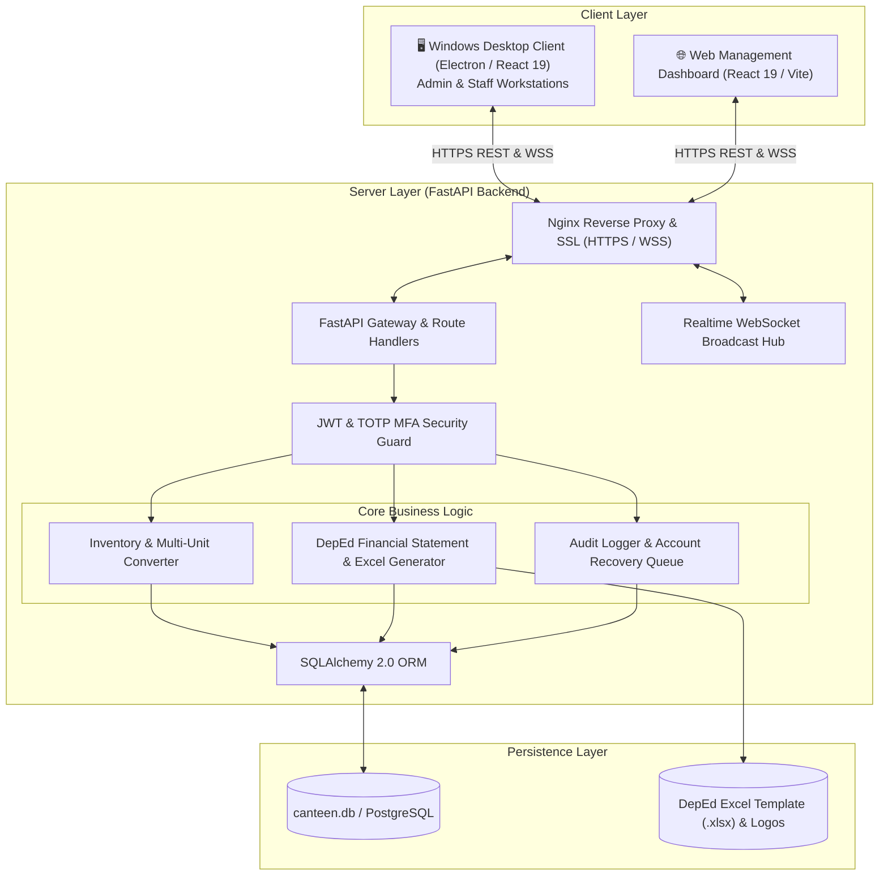

# 🍽️ SmartCanteen (MEALS) — Canteen Management & DepEd Financial Reporting System

[](https://fastapi.tiangolo.com)
[](https://react.dev/)
[](https://vitejs.dev/)
[](https://www.electronjs.org/)
[](https://tailwindcss.com/)
[](https://www.python.org/)
[](https://www.sqlalchemy.org/)
[](https://opensource.org/licenses/MIT)

**SmartCanteen** (powered by the **MEALS** engine — *Management of Expenses, Assets, and Logistics System*) is an enterprise-grade school canteen management, multi-unit inventory tracking, and Department of Education (DepEd) financial compliance platform.

Designed specifically for educational institutions, the system unifies centralized inventory control, statutory fund accounting, real-time WebSocket alerts, multi-factor authentication (TOTP), and automated official DepEd monthly financial statement generation with live Excel export (`.xlsx`).

---

## 📑 Table of Contents

- [System Architecture](#-system-architecture)
- [Key Features](#-key-features)
- [Project Directory Structure](#-project-directory-structure)
- [Tech Stack Overview](#-tech-stack-overview)
- [Prerequisites](#-prerequisites)
- [Quick Start Guide](#-quick-start-guide)
  - [1. Backend Setup](#1-backend-setup)
  - [2. Desktop & Web Client Setup (`smartcanteen`)](#2-desktop--web-client-setup-smartcanteen)
  - [3. Running the System](#3-running-the-system)
- [Desktop Client & Distribution](#-desktop-client--distribution)
- [Role-Based Access Control (RBAC) & Credentials](#-role-based-access-control-rbac--credentials)
- [DepEd Financial Reporting & Excel Automation](#-deped-financial-reporting--excel-automation)
- [Production Deployment](#-production-deployment)
- [Subproject Documentation](#-subproject-documentation)
- [License & Maintainer](#-license--maintainer)

---

## 🏛 System Architecture



---

## ✨ Key Features

### 📊 1. DepEd-Compliant Financial Reporting & Fund Management
- **Statutory Canteen Operations Framework**: Built to strictly adhere to official Department of Education (DepEd) school canteen accounting guidelines.
- **Automated Statement Computation**: Automatically calculates Gross Sales, Cost of Goods Sold (COGS), Beginning/Ending Inventories, Operating Expenses, and Net Operating Income.
- **Statutory Allocation Distribution**: Automatically computes mandatory percentage splits across statutory funds:
  - Supplementary Feeding Program (**35%**)
  - Canteen Revolving & Operations Fund (**25%**)
  - Faculty & Student Development Fund (**15%**)
  - School Clinic Fund (**5%**)
  - Administrative Operations Fund (**20%**)
- **Excel Spreadsheet Automation**: Injects live calculations into standard official workbook templates (`.xlsx`) while preserving cell formatting, formulas, styles, and institutional logos.
- **Expense Voucher Proofs**: Attach and manage expense receipts with image storage and MIME type support.

### 📦 2. Multi-Unit Inventory & Stock Control
- **Discrete & Bulk Measurement**: Supports countable items (`pcs`) and continuous bulk measures (`kg`, `g`, `l`, `ml`) with automatic conversions.
- **Stock Threshold Alerts**: Real-time deduction tracking with configurable `min_stock` threshold warnings.
- **Category & Catalog Management**: Organize products by category, manage cost/selling prices, barcodes, and favorite items.

### 🔐 3. Enterprise Security & Multi-Factor Authentication
- **Role-Based Access Control**: Strict privilege separation between `admin` and `staff` users.
- **Time-based MFA (TOTP)**: Google Authenticator-compatible two-factor authentication with QR provisioning, backup recovery codes, and 30-day trusted device memory.
- **Admin Recovery Queue**: Formal review workflow for user password resets and MFA recovery requests.
- **Audit Logging**: Comprehensive activity tracking with timestamp and IP recording.

### ⚡ 4. Real-Time WebSockets & Dynamic Modules
- **WebSocket Broadcast Hub**: Live `/api/realtime/alerts` channel notifying staff of low stock levels and administrative events.
- **Feature Module Toggles**: Enable or disable functional modules on the fly from Admin Settings.

---

## 📂 Project Directory Structure

```text
SmartCanteen/
├── backend/                       # FastAPI Backend Application
│   ├── auth.py                    # JWT authentication & TOTP MFA logic
│   ├── database.py                # Database engine & SQLAlchemy session factory
│   ├── demo_data.py               # Demo datasets & database seeder
│   ├── financial_reports.py       # DepEd financial calculations & Excel generator
│   ├── main.py                    # Main FastAPI server, routes & WebSockets
│   ├── models.py                  # Declarative SQLAlchemy ORM models
│   ├── report_templates/          # Official DepEd Excel workbook templates & logos
│   │   ├── CANTEEN-REPORT-2025-2026-2 (1).xlsx
│   │   └── deped_logo.jpg
│   ├── requirements.txt           # Python dependency specifications
│   ├── schemas.py                 # Pydantic request and response schemas
│   └── time_utils.py              # Philippine Timezone (Asia/Manila) utilities
│
├── smartcanteen/                  # Primary Desktop & Web Client (React 19 + Electron)
│   ├── electron/                  # Electron main process & desktop configuration
│   │   ├── config.json            # Desktop API endpoint configuration
│   │   ├── main.cjs               # Electron main entry point
│   │   └── preload.cjs            # Electron secure context bridge
│   ├── src/                       # React 19 UI Application
│   │   ├── assets/                # Static assets and icons
│   │   ├── components/            # Reusable UI components & modals
│   │   ├── contexts/              # Auth, Theme, and Alert Contexts
│   │   ├── services/              # API HTTP & WebSocket clients
│   │   ├── views/                 # View pages (Financials, Inventory, Settings, etc.)
│   │   ├── App.jsx                # Application root router & layout
│   │   ├── index.css              # Global styles & TailwindCSS tokens
│   │   └── main.jsx               # React DOM mount entry point
│   ├── package.json               # Node.js dependencies & scripts
│   ├── tailwind.config.js         # TailwindCSS styling configuration
│   └── vite.config.js             # Vite bundler configuration
│
├── MEALS/                         # Production Release & Deployment Artifacts
│   ├── Client/                    # Precompiled Windows Desktop Binaries
│   │   ├── MEALS Setup.exe        # NSIS Windows Installer
│   │   ├── MEALS.exe              # Standalone Portable Executable
│   │   └── README.md              # Client installation guide
│   └── Server/                    # Production Server Deployment Configuration
│       ├── DEPLOYMENT_GUIDE.md    # VPS server operations manual
│       ├── init_db.py             # Server database initialization script
│       ├── meals-backend.service  # Systemd service definition
│       ├── nginx.conf             # Nginx reverse proxy configuration
│       └── start_server.sh        # Server launch script
│
├── deploy/                        # Nginx deployment configurations
│   └── nginx-smartcanteen.conf    # Production Nginx reverse proxy profile
│
├── scripts/                       # Deployment and automation scripts
│   └── deploy.sh                  # One-line server build & deployment script
│
├── app.py                         # Root entry point to launch FastAPI backend
├── canteen.db                     # SQLite database file (auto-generated)
├── inspect_db.py                  # Database diagnostics & table inspector
└── README.md                      # Master Repository Documentation (this file)
```

---

## 🛠 Tech Stack Overview

| Layer | Technologies |
| :--- | :--- |
| **Backend Framework** | [FastAPI](https://fastapi.tiangolo.com/) `0.115.12`, [Uvicorn](https://www.uvicorn.org/) `0.29.0`, [Pydantic](https://docs.pydantic.dev/) `2.10.6` |
| **Database & ORM** | [SQLAlchemy](https://www.sqlalchemy.org/) `2.0.49`, SQLite, [psycopg](https://www.psycopg.org/) `3.2.6` (PostgreSQL) |
| **Data Processing** | [Pandas](https://pandas.pydata.org/) `2.2.2`, [NumPy](https://numpy.org/) `1.26.4` |
| **Spreadsheet Automation** | [OpenPyXL](https://openpyxl.readthedocs.io/) `3.1.5`, [Pillow](https://python-pillow.org/) `>=10.0.0` |
| **Security & Auth** | [python-jose](https://github.com/mpdavis/python-jose) `3.3.0` (JWT), [bcrypt](https://github.com/pyca/bcrypt) `4.1.3`, Google Authenticator TOTP |
| **Frontend Framework** | [React](https://react.dev/) `19.2.4`, [Vite](https://vitejs.dev/) `8.0.4`, [React Router](https://reactrouter.com/) `7.14.1` |
| **Styling & UI** | [TailwindCSS](https://tailwindcss.com/) `4.2.2`, [Heroicons](https://heroicons.com/) `2.2.0` |
| **Desktop Runtime** | [Electron](https://www.electronjs.org/) `33.2.1`, [electron-builder](https://www.electron.build/) `25.1.8` |

---

## 📦 Prerequisites

Ensure you have the following installed on your machine:
- **Python**: `3.10`, `3.11`, or `3.12`
- **Node.js**: `18.x`, `20.x`, or `22.x` (with `npm`)
- **Git**: Latest version
- *(Optional for Desktop packaging)*: Windows OS for NSIS/portable `.exe` compilation

---

## 🚀 Quick Start Guide

### 1. Backend Setup

1. **Create and activate a Python virtual environment**:
   ```bash
   # Windows (PowerShell)
   python -m venv venv
   .\venv\Scripts\Activate.ps1

   # Linux / macOS
   python3 -m venv venv
   source venv/bin/activate
   ```

2. **Install Python dependencies**:
   ```bash
   pip install --upgrade pip
   pip install -r backend/requirements.txt
   ```

3. **Launch the FastAPI backend server**:
   ```bash
   python app.py
   # Or using uvicorn directly:
   uvicorn backend.main:app --reload --host 0.0.0.0 --port 8000
   ```
   - **Swagger Interactive API Docs**: [http://localhost:8000/docs](http://localhost:8000/docs)
   - **ReDoc Documentation**: [http://localhost:8000/redoc](http://localhost:8000/redoc)
   - **Health Check**: [http://localhost:8000/api/health](http://localhost:8000/api/health)

---

### 2. Desktop & Web Client Setup (`smartcanteen`)

1. **Navigate into the client directory**:
   ```bash
   cd smartcanteen
   ```

2. **Install Node.js dependencies**:
   ```bash
   npm install
   ```

3. **Configure Environment Variables (Optional)**:
   Create `.env.local` inside `smartcanteen/`:
   ```env
   VITE_API_BASE_URL=http://127.0.0.1:8000/api
   VITE_API_PROXY_TARGET=http://127.0.0.1:8000
   ```

4. **Run the Vite Development Server**:
   ```bash
   npm run dev
   ```
   Accessible at [http://localhost:5173](http://localhost:5173).

---

### 3. Running the System

| Service | Command | URL / Endpoint |
| :--- | :--- | :--- |
| **FastAPI Backend** | `python app.py` | `http://localhost:8000` |
| **Swagger UI** | *(Automatic)* | `http://localhost:8000/docs` |
| **Web Dashboard** | `cd smartcanteen && npm run dev` | `http://localhost:5173` |
| **Electron Desktop** | `cd smartcanteen && npm run electron:start` | Native Desktop Window |

---

## 🖥 Desktop Client & Distribution

The **MEALS Desktop Client** runs on Windows PCs with local file persistence and dynamic server configuration without terminal requirements.

### Compiling Desktop Binaries:
```bash
cd smartcanteen
npm run electron:build
```
This generates binaries in `smartcanteen/dist-electron/`:
- **`MEALS Setup.exe`**: Full NSIS installer with Desktop and Start Menu shortcuts.
- **`MEALS.exe`**: Standalone portable single executable.

### Runtime Server Configuration:
1. Open `config.json` in the application directory.
2. Specify the central server URL:
   ```json
   {
     "apiBaseUrl": "https://smartcanteen.yourdomain.com/api"
   }
   ```
3. Launch `MEALS.exe`.

---

## 👥 Role-Based Access Control (RBAC) & Credentials

Default initialized user accounts:

| Username | Password | Role | Permissions & Scope |
| :--- | :--- | :--- | :--- |
| **`admin`** | `admin123` | `admin` | Full administrative control: User management, module switches, DepEd financial reporting & Excel export, audit logs, and inventory management. |
| **`staff`** | `staff123` | `staff` | Inventory & canteen operations: Stock replenishment, stock adjustments, low-stock alerts, and read-only reports. |

---

## 📑 DepEd Financial Reporting & Excel Automation

SmartCanteen strictly follows Department of Education (DepEd) school canteen operational accounting standards:

- **Revenue & COGS Tracking**: Automatic aggregation of sales and cost of goods sold.
- **Itemized Operational Expenses**: Disbursed expense logging (utilities, transport, kitchen supplies, salaries) with receipt attachments.
- **DepEd Statutory Fund Shares**: Real-time distribution across statutory percentages:
  - Supplementary Feeding Program: **35%**
  - Canteen Revolving & Operations Fund: **25%**
  - Faculty & Student Development: **15%**
  - School Clinic Fund: **5%**
  - Administrative Operations: **20%**
- **Excel Spreadsheet Automation**: Seamless injection of calculated matrices into the official workbook template (`report_templates/CANTEEN-REPORT-2025-2026-2 (1).xlsx`), retaining cell formulas, styling, formatting, and institutional logos.

---

## 🌐 Production Deployment

For complete instructions on deploying the MEALS backend to an Ubuntu/Debian virtual server (VPS) with Nginx, SSL (Certbot), systemd background services, and automated daily backups, refer to:
- [MEALS Server Deployment Guide](file:///c:/Users/ronal/OneDrive/Desktop/New%20folder%20%2811%29/MEALS/Server/DEPLOYMENT_GUIDE.md)
- [Automated Deployment Shell Script](file:///c:/Users/ronal/OneDrive/Desktop/New%20folder%20%2811%29/scripts/deploy.sh)
- [Nginx Server Configuration](file:///c:/Users/ronal/OneDrive/Desktop/New%20folder%20%2811%29/deploy/nginx-smartcanteen.conf)

---

## 📚 Subproject Documentation

| Component | Documentation Link | Description |
| :--- | :--- | :--- |
| **Backend API** | [backend/README.md](file:///c:/Users/ronal/OneDrive/Desktop/New%20folder%20%2811%29/backend/README.md) | FastAPI architecture, endpoints, and data models |
| **Desktop / Web Client** | [smartcanteen/README.md](file:///c:/Users/ronal/OneDrive/Desktop/New%20folder%20%2811%29/smartcanteen/README.md) | React 19 and Electron build and development guide |
| **MEALS Release Package** | [MEALS/README.md](file:///c:/Users/ronal/OneDrive/Desktop/New%20folder%20%2811%29/MEALS/README.md) | Packaged distribution and deployment overview |
| **VPS Deployment Guide** | [MEALS/Server/DEPLOYMENT_GUIDE.md](file:///c:/Users/ronal/OneDrive/Desktop/New%20folder%20%2811%29/MEALS/Server/DEPLOYMENT_GUIDE.md) | Step-by-step production operations manual |

---

## 📄 License & Maintainer

Distributed under the **MIT License**. See `LICENSE` for details.

Developed and maintained by **Ronald Mark** ([@RonaldMark17](https://github.com/RonaldMark17)).  
*SmartCanteen / MEALS — Modern, Efficient, Automated, Learning-driven Smart Canteen System.*
